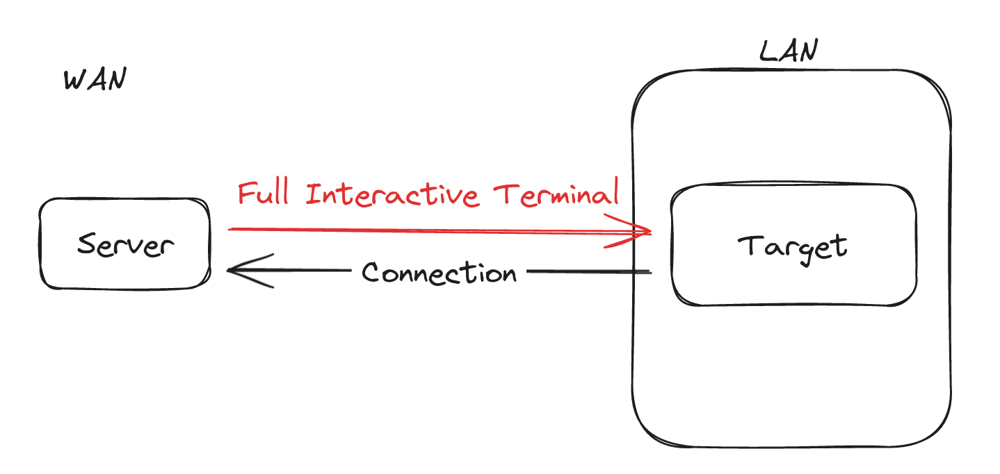

# PurpCMD

Purpcmd operates by initiating a simple SSH server on the client side. Leveraging SSH has many improved features to work with remote terminals, such as enhanced interaction quality, window resizing, full duplex communications, and more. This type of approach tends to work better than using reverse shell, that use system features, synchronized sockets and IO, it will have limited capabilities. Purpcmd employs a reverse WebSocket connection to seamlessly synchronize the SSH connection with the server.

The communication is secure and very malleable. It can be channeled through Content Delivery Network (CDN) to enhance obfuscation and other security measures.



Start the server:

```
~$ go run . -l
2024/01/06 16:38:26 Listening on ws://0.0.0.0:8081/
2024/01/06 16:38:28 TCP Listener up on 0.0.0.0:8080
```

Connect with the client:

```
$ go run . -c
2024/01/06 17:04:36 Connecting to ws://0.0.0.0:8081/
2024/01/06 17:04:36 + Proxy connected
```

Connect to the server using SSH:

```
$ ssh 0.0.0.0 -p 8080 -i id_ecdsa
user@go:~/go/src/PurpleCommand$ ls
go.mod  go.sum  img  main.go  README.md  src
usero@go:~/go/src/PurpleCommand$
```
