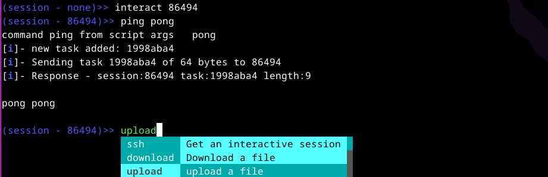

# PurpCMD

PurpleCommand is a modular and extensible C2 framework designed for supporting red team operations and security researching. It provides a customizable platform for simulating advanced adversary behaviors and managing post-exploitation tasks. The main target OS will be Linux for now since this is my research subject.

The main ability of PurpC is the capability of initiating a reverse shell with SSH over websockets. It operates by initiating a simple SSH server on the client side. Leveraging SSH has many improved features to work with remote terminals, such as enhanced interaction quality, window resizing, full duplex communications, and more. This type of approach tends to work better than using reverse shell, that use system features, synchronized sockets and IO, it will have limited capabilities. Purpcmd employs a reverse WebSocket connection to seamlessly synchronize the SSH connection with the server.

